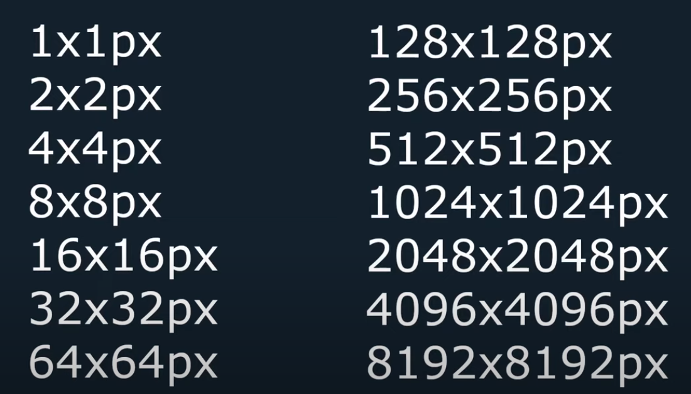

## Group 14: QUESTION

#### How would you set the color of OpenGl display to green and change the fill color to have texture? Do a demonstration example with the circle with parameter starting coordinates (-3,1) and radius of 4 cm and texture type of the circle of your choice ( mention in the write up what you used)


```
what is texture
- Texture is basically an image applied to a polygon or a mesh 
```

> ## Types of Texures
> - 1D : Typically used for storing data or color gradients, 
> - 2D : This is what we used for our circle. It's the most common texture type, representing images.2D(what we used) 
> - 3D : Used for volumetric textures like smoke or clouds.


>## Texture Size
> - **Square texture**  are often preferred due to their aspect ratio and simplicity in mapping coordinates.



> #### Interpolation Types
> - Two main types are used to determine how texture pixels (texels) are mapped onto the shape:
> - **GL_NEAREST:** Provides a pixelated look, as it uses the nearest texel's color.
> - **GL_LINEAR:** Smooths out the texture by averaging the colors of nearby texels.


> #### Texture Mapping Modes
> - Different modes control how textures are applied:
  > - **GL_REPEAT:** Repeats the texture outside its normal 0-1 coordinate range.
  > - **GL_MIRRORED_REPEAT:** Like repeat, but mirrors the texture with each repeat.
  > - **GL_CLAMP_TO_EDGE:** Stretches the edge pixels of the texture to fill the shape.
  > - **GL_CLAMP_TO_BORDER:** Fills beyond the edge with a specified border color.

> #### Mipmaps
> - Mipmaps are used for efficiently rendering textures at various distances by using scaled-down versions of the texture.

#### Texture Coordinates 
- Coordinates determine how the texture is applied to the shape. They are typically defined in a normalized space (0 to 1).

### Implementation in our Circle Example
- **Texture Used:** For our demonstration, we chose a standard 2D texture featuring a natural pattern (e.g., wood grain or marble) to give the circle a realistic appearance.
- **Setting the Background Color:** To set the OpenGL display color to green, we use `glClearColor(0.0, 1.0, 0.0, 1.0)` at the beginning of our rendering loop.
- **Applying the Texture:** The circle is rendered with the chosen texture using texture mapping. The texture coordinates are carefully mapped to each vertex of the circle.

## Links
- [OpenGL with Python 3: Adding Textures ](https://www.youtube.com/watch?v=ZK1WyCMK12E&t=180s)

- [OpenGL Tutorial 6 - Textures](https://youtu.be/u-00hjlfMKc)

- [OpenGL with python: intro and setup:](https://www.youtube.com/watch?v=LCK1qdp_HhQ&list=PLn3eTxaOtL2PDnEVNwOgZFm5xYPr4dUoR&index=1&t=10s&pp=iAQB)
