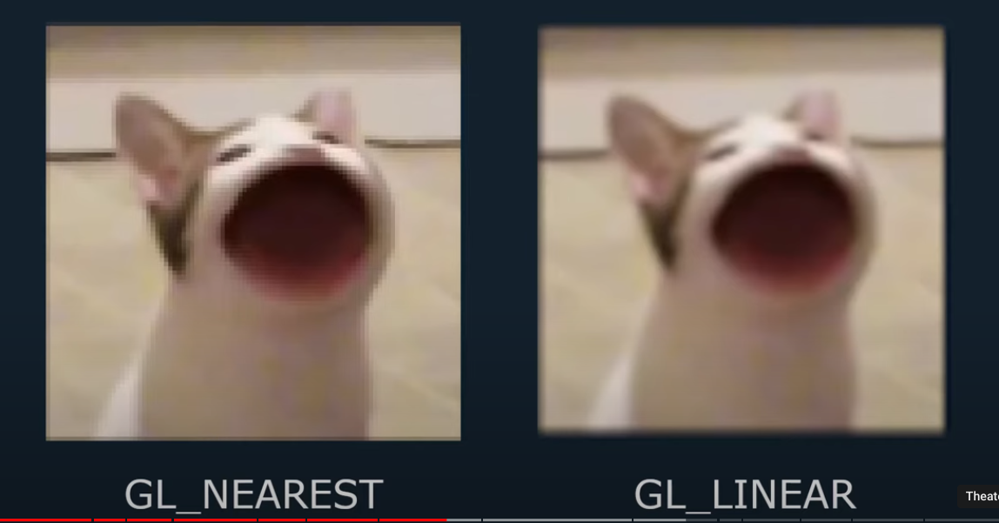
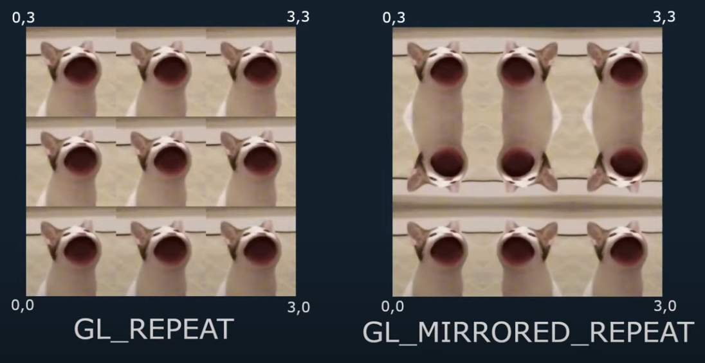
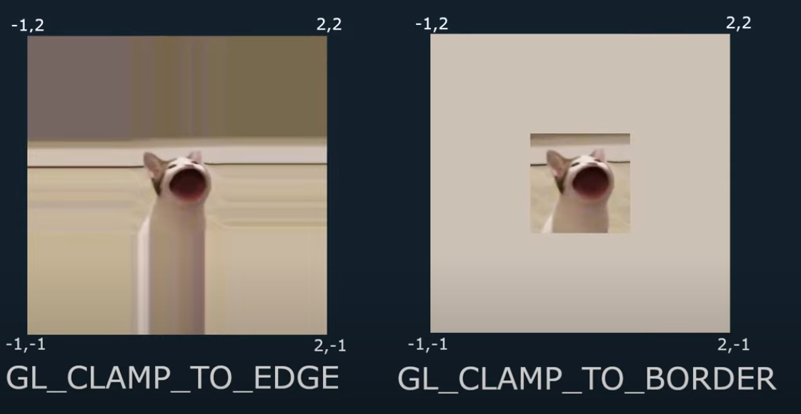
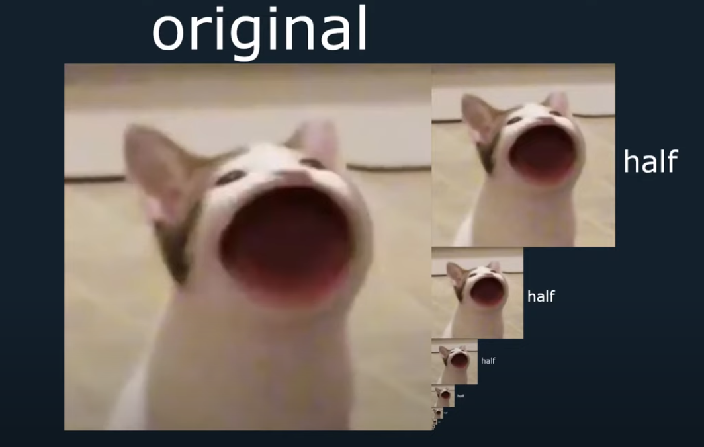
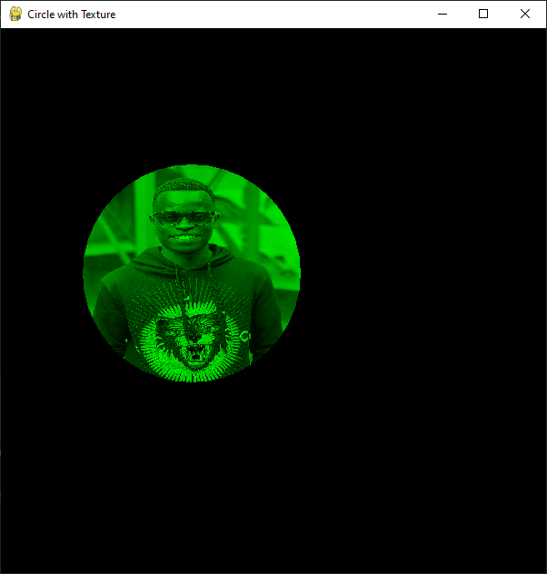
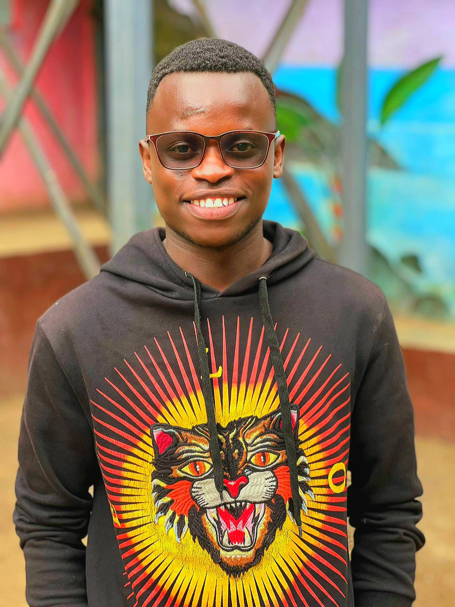
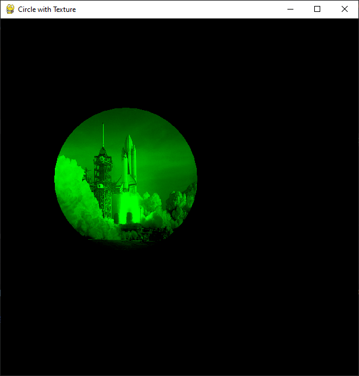
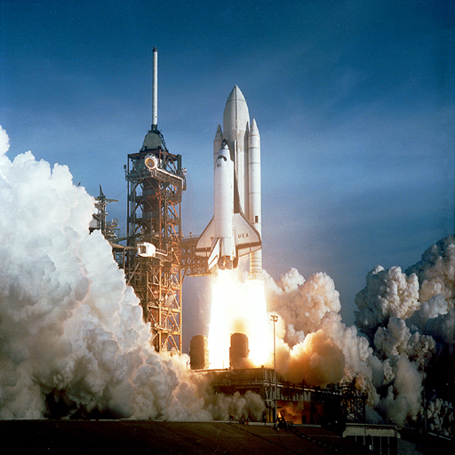

# Group 14: QUESTION

**How would you set the color of OpenGl display to green and change the fill color to have texture? Do a demonstration
example with the circle with parameter starting coordinates (-3,1) and radius of 4 cm and texture type of the circle of
your choice ( mention in the write up what you used)**

## What is a Texture?

- Texture is basically an image applied to a polygon or a mesh

### Types of Textures

> - 1D : Typically used for storing data or color gradients,
> - 2D : This is what we used for our circle. It's the most common texture type, representing images.2D(what we used)
> - 3D : Used for volumetric textures like smoke or clouds.

### Texture Size

> - **Square texture**  are often preferred due to their aspect ratio and simplicity in mapping coordinates.

### Interpolation Types

> - Two main types are used to determine how texture pixels (texels) are mapped onto the shape:
> - **GL_NEAREST:** Provides a pixelated look, as it uses the nearest texel's color.
> - **GL_LINEAR:** Smooths out the texture by averaging the colors of nearby texels.

### Texture Mapping Modes

> - Different modes control how textures are applied:
> - **GL_REPEAT:** Repeats the texture outside its normal 0-1 coordinate range.
> - **GL_MIRRORED_REPEAT:** Like repeat, but mirrors the texture with each repeat.
> - **GL_CLAMP_TO_EDGE:** Stretches the edge pixels of the texture to fill the shape.
> - **GL_CLAMP_TO_BORDER:** Fills beyond the edge with a specified border color.

> ### Mipmaps
> - Mipmaps are used for efficiently rendering textures at various distances by using scaled-down versions of the
    texture.

### Texture Coordinates

> - Coordinates determine how the texture is applied to the shape. They are typically defined in a normalized space (0
    to
    1).

### Implementation in our Circle Example

### 1. Material Class

The `Material` class in [material.py](material.py) is the one responsible for initializing the texture
that we are using. It takes in a single parameter named filepath
that is the path to the texture to be used.

The `__init__` method begins by generating a single texture using `glGenTextures(1)` and
the texture is made the current texture using `glBindTexture` thus priming it for further
manipulation using the `glTexParameteri` function calls.

The first pair of `glTexParameteri` calls set the texture mapping mode to GL_REPEAT

Then we load our image using [`pygame.image.load`](https://www.pygame.org/docs/ref/image.html#pygame.image.load)
and pass it in to the `glTexImage2D` function which associates our texture with the loaded image.

`glTexImage2D` has the following prototype:

`glTexImage2D(target, level, internalFormat, width, height, border, externalFormat, type, *pointer)`

1. **target** - The currently bound texture,
2. **level** - The mipmap level to associate the current level image with. The image with the highest resolution
3. (the original image) is at level 0.
4. **internalFormat** - The format with which OpenGL will interpret the image
5. **width and height** - The dimensions of the image
6. **border** - The width of the border around the image. Set to 0 for no border
7. **externalFormat** - The format with which the external image is represented with
8. **type** - The underlying data type of the image data
9. ***pointer** - A pointer to the image data (in Python, we can just pass the reference of the variable)

We then conclude the `__init__` method by calling `glGenerateMipMap` and `glEnable` which gives us the ability
to draw the textures using OpenGL immediate mode (without shaders and VBOs and VAOs)

The `destroy` method call frees the memory allocated during the creation of the texture.

### 2. CompatibilityApp class

This defines the main application logic. It uses Pygame to initialize the drawing window
instead of other libraries traditionally used alongside OpenGL
like [GLUT](https://www.opengl.org/resources/libraries/glut/glut_downloads.php)
(or [FreeGLUT](https://freeglut.sourceforge.net/)) and [GLFW](https://www.glfw.org/).

_Henceforth, `pygame` is referred to by the alias `pg`_

The window is created by calling the method `pg.display.setmode` which receives
the size of the window and the flag `pg.OPENGL | pg.DOUBLEBUF | pg.RESISABLE` for a resizable window
with an OpenGL drawing context and double-buffering.

The method `pg.display.gl_set_attributes` here is used to set the `GL_CONTEXT_PROFILE_MASK` to
`GL_CONTEXT_PROFILE_COMPATIBILITY` so that we can use OpenGL immediate mode features.
(Here, we are not using modern shader-based OpenGL)

The `resize` method defines the size and projection for our viewport and is called
not only when the window is created, but also when the window is resized (check the event loop in `main_loop`)
The dimensions of our viewing box is as defined in the call to `glOrtho`.

The field circle_attributes is a 4-tuple of the form
(x, y, z, r) that stores the x, y and z coordinates of the center of the circle and the radius of the circle.
Currently, it is hard-coded to 4 as required by our question. This is what is passed to the `generate_circle_points`
explained below.

The points for the circle are generated by the creatively named `generate_circle_points` method based
on the mathematical definition of a circle:

$$x = r * cos(\theta)$$

$$y = r * sin(\theta)$$

where $$0 <= \theta <= 2\pi$$

The s and t coordinates (discussed earlier) of the texture are also generated at the same time, starting from
the in this method using the formulas:

$$s = 0.5 + 0.5 * cos(\theta)$$

$$t = 0.5 + 0.5 * sin(\theta)$$

`generate_circle_points` thus returns a list of 5-tuples of the form
(x, y, z, s, t) with the first three being the points of the vertex of the circle
and the s, t coordinates of the texture to be painted on the circle.

These are used by the `draw_circle` method where the `glTexCoord2f` and `glVertex3f`
methods are called. The color is filled with a green colour in the call to `glColor3f` for
all the vertices as required by the question. This gives a green tint to the image.

### Output

Here is the green circle, without a texture:

Here is the the output with a 1200 by 1600 JPEG image:

Compare this with the original image:

We can see that the image is slightly distorted. This is a consequence of
what we mention earlier in
the [texture size section](#texture-size).
OpenGL is better optimized for square images whose sizes are powers of 2.
The image here does not fit this criteria.

Compare this with the output of a 512 by 512 image BMP image (`pg.image.convert` handles the different file formats for
us)

and the original image

The width of the image is much better respected in the latter

The `destroy` method of the CompatibilityApp class frees all the resources
it has created by calling the `destroy` method of the instance of the `Material` class it creates
(in the code, it is called `self.edwin_texture`), and `pg.quit` for
Pygame-specific resources like the window. This method is called whenever there is a `pg.QUIT` event is received in the
event loop.

### main.py

This is the entry point of the application and it just creates an instance of `CompatibilityApp` and calls the
instance's `main_loop` method.

## Links

These are links to YouTube videos that were immensely helpful while doing exploring textures what textures are and how
to use them in OpenGL and using Python.

- [OpenGL with Python 3: Adding Textures](https://www.youtube.com/watch?v=ZK1WyCMK12E&t=180s) - This showed the setup
  required to add a texture in Python. However, the video was done using shader-based OpenGL

- [OpenGL Tutorial 6 - Textures](https://youtu.be/u-00hjlfMKc) - Actually the screenshots in
  the [first part of this document](#what-is-a-texture)
  are sourced from this video. It explains what textures are really well. However, this is also done in shader-based
  OpenGL.

- [OpenGL with Python: Intro and Setup](https://www.youtube.com/watch?v=LCK1qdp_HhQ&list=PLn3eTxaOtL2PDnEVNwOgZFm5xYPr4dUoR&index=1&t=10s&pp=iAQB)
  shows how to configure one's environment to work with OpenGL and Pygame.

## Other Material

The book [Computer Graphics Through OpenGL - From Theory to Experiments (3rd Edition)](https://www.taylorfrancis.com/books/mono/10.1201/9780429464171/computer-graphics-opengl%C2%AE-sumanta-guha) by Sumanta Guha was a key
reference
